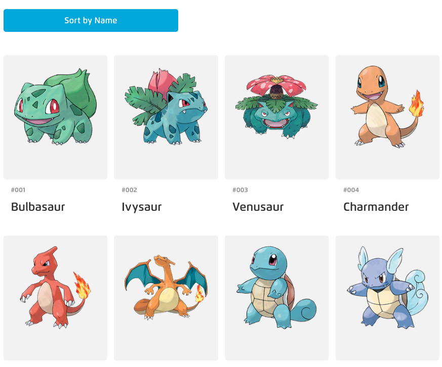

# Pokedex Express App (with POST request)

We will build our first web app using Node.js and Express - a Pokedex app.

For this exercise, we will continue building our Pokedex web app - setting up our server to accept POST requests to save user-provided data. We will serve a form to the user for them to send data to our server to create a new pokemon.

The starter code in this repository builds upon the previous exercise's ([pokedex-express](https://github.com/wdi-sg/pokedex-express)).

## Getting Started

1.  Fork and clone this repository to your computer
2.  Run `yarn install` to install dependencies
3.  Look in the starter file called `index.js`, run `nodemon` to start local server on port 3000
4.  Open `localhost:3000` on your browser and see the home page

#### Note on comments:

The comments in this file are deliberately verbose meant to orientate you to an Express app for the first time. Feel free to remove any or all comments.

## Deliverables

* Expose a new route that intercepts GET requests to `/`, which responds with a HTML page with a `form` that has these fields: `name`, `img`, `height`, and `weight`

* Point the form to submit data to the root route (`/`) using POST method

* Expose a new endpoint that intercepts POST requests to `/`, which parses the form data, adds default values if they are missing, and saves the new pokemon data into `pokedex.json` (default values to add: `"id": null`, `"num": null`)

* Add a "Sort by name" button to the homepage (`pokemon.handlebars`) that when clicked, sends a GET request with a query parameter specifying "?sortby=name"
  * Try to implement the button as an element within a `form` tag with `action="/"` and `method="POST"` - so you don't have to write an AJAX request in JavaScript

* Modify your GET `/` logic to handle the new query parameter, returning an HTML page with all the pokemon sorted by their names (whereas previously it was sorted by ID)

## Further

* Instead of saving `id` and `num` as `null` values, implement the logic that automatically increments the `id` and `num` of every newly created pokemon
  * eg. if last pokemon in the `pokedex.json` has `"id": 151` and `"num": "151"`, the new pokemon object should have `"id": 152` and `"num": "152"`

* Create a `public/` folder that contains a `css/` folder and a `style.css` within it, and use `app.use(express.static('public'))` tell Express to look into the `public/` folder for assets that should be publicly available (eg. CSS files, JavaScript files, images, etc.)

* Style your homepage according to this screenshot (your images may look different)

